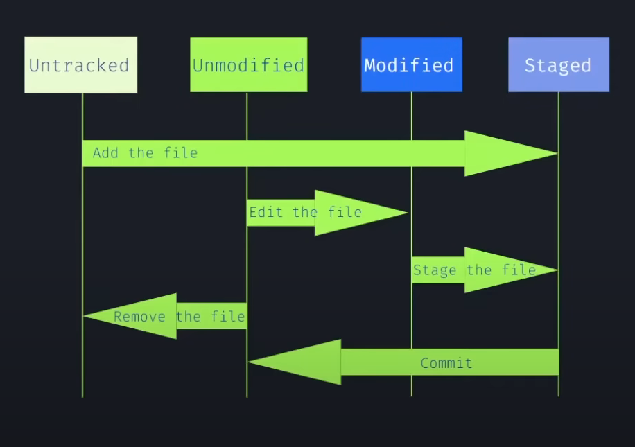

## Versionamento

São os conjuntos de diferentes versões que um dado código, por exemplo, teve durante a sua confecção. Para isso é importante utilizar ferramentas que possam ajudar e auxiliar este processo de versionamento

## Git

Nesse momento que vem o git, no qual é uma ferramenta que faz o versionamento do seu código. Com algumas características: 
    
+ **Snapshots** são versões do seu código;
    + São realizados hahs para organizar essas snapshots
+ A maioria das operações feitas pelo git são realizadas no próprio computador;

## Estados do git
